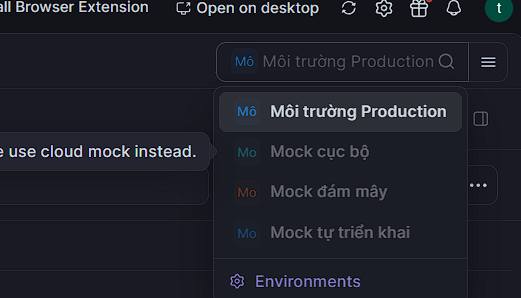
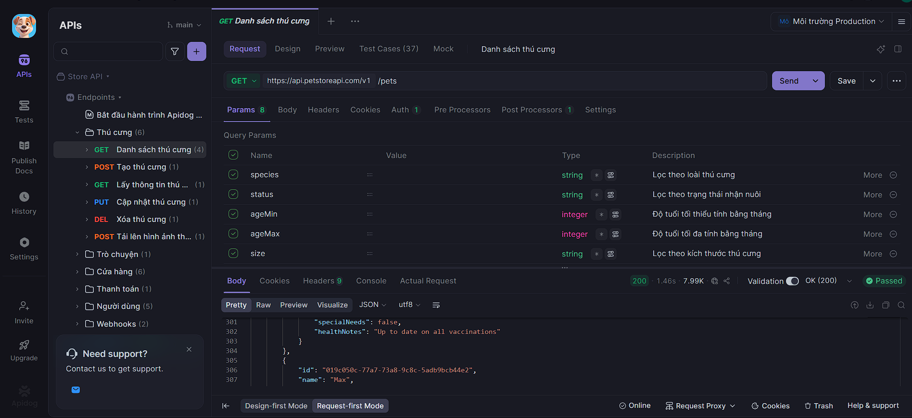
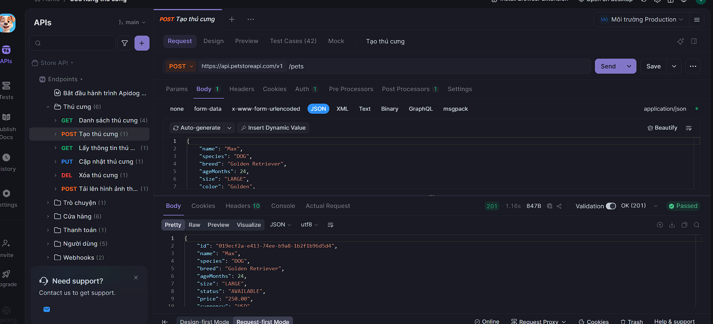
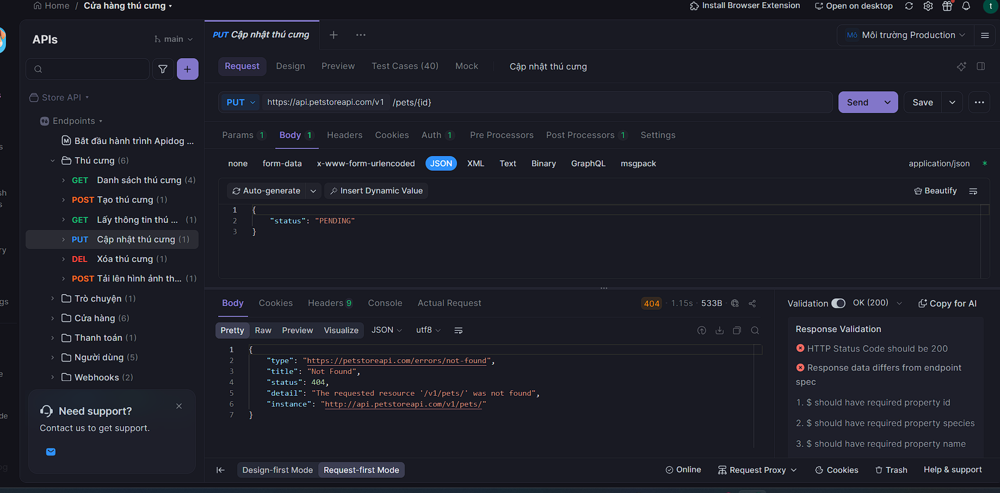
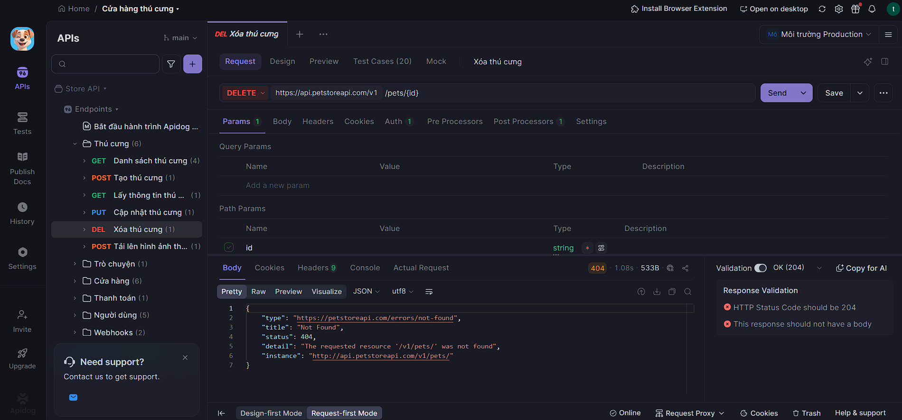

# BÁO CÁO BÀI TẬP: CẤU HÌNH VÀ KIỂM THỬ HIỆU NĂNG API BẰNG APACHE JMETER

## 1. Thông tin sinh viên
- **Họ và tên:** Đào Duy Thắng

---

## 2. Mục tiêu bài tập
- Biết cách tìm kiếm, khảo sát thông tin cấu hình API (Method, URL, Path, Body) từ các công cụ quản lý API.
- Sử dụng thành thạo Apache JMeter để thiết lập kịch bản kiểm thử hiệu năng cho các API vừa khảo sát.
- Hiểu cách cấu hình HTTP Request Sampler dựa trên các dữ liệu thực tế.

---

## 3. Nhật ký khảo sát dữ liệu API trên Apidog để đưa vào JMeter

Để tiến hành giả lập tải bằng JMeter, trước tiên em sử dụng công cụ Apidog để khởi tạo và lấy thông tin kịch bản mẫu của hệ thống Cửa hàng thú cưng (Pet Store).

*Hình 1: Khởi tạo dự án mẫu trên Apidog để lấy thông tin kịch bản API*

*Hình 2: Khảo sát các thư mục chức năng (Thú cưng, Cửa hàng, Người dùng...) để chọn API kiểm thử*

---

## 4. Chi tiết các bước cấu hình kịch bản trong phần mềm JMeter

Dưới đây là chi tiết các bước thiết lập kịch bản kiểm thử tải trong phần mềm Apache JMeter dựa trên các thông số thu thập được từ Apidog:

### Bước 4.1: Cấu hình Nhóm người dùng ảo (Thread Group) trong JMeter
- **Number of Threads (users):** Thiết lập `50` (Giả lập 50 người dùng ảo truy cập đồng thời).
- **Ramp-up period (seconds):** Thiết lập `10` giây (Cứ mỗi giây hệ thống tự động kích hoạt thêm 5 người dùng ảo).
- **Loop Count:** Thiết lập `1` (Mỗi người dùng thực hiện kịch bản 1 lần).

---

### Bước 4.2: Cấu hình kịch bản lấy danh sách thú cưng (GET Request)
Từ thông tin khảo sát trên Apidog, API trả về trạng thái mã thành công `200 Passed`.

*Hình 3: Xác định Phương thức GET và Path /pets trên Apidog*

*Hình 4: Xác định môi trường chạy và tên miền hệ thống*

*Hình 5: Kết quả phản hồi thành công (200 Passed) làm cơ sở đối chiếu số liệu*

👉 **Thông số nhập tương ứng vào ô HTTP Request trong JMeter:**
- **Protocol [http]:** `https`
- **Server Name or IP:** `api.petstoreapi.com`
- **HTTP Request [Method]:** Chọn `GET` từ menu thả xuống của JMeter.
- **Path:** Điền `/v1/pets`

---

### Bước 4.3: Cấu hình kịch bản tạo mới dữ liệu (POST Request)
Khảo sát chức năng yêu cầu gửi kèm dữ liệu cấu trúc vật nuôi dưới định dạng JSON với mã thành công `201 Passed`.

*Hình 6: Khảo sát cấu trúc Body JSON của phương thức POST*

👉 **Thông số nhập tương ứng vào ô HTTP Request trong JMeter:**
- **Protocol [http]:** `https`
- **Server Name or IP:** `api.petstoreapi.com`
- **HTTP Request [Method]:** Chọn `POST`
- **Path:** Điền `/v1/pets`
- **Mục Body Data trong JMeter:** Copy và dán đoạn mã JSON cấu trúc chú chó "Max" sau đây vào:

    {
      "name": "Max",
      "species": "DOG",
      "breed": "Golden Retriever",
      "ageMonths": 24,
      "size": "LARGE",
      "color": "Golden"
    }

*(Lưu ý: Cần thêm một `HTTP Header Manager` dưới Thread Group trong JMeter và điền thuộc tính `Content-Type: application/json` để JMeter hiểu định dạng Body này).*

---

### Bước 4.4: Phân tích kịch bản lỗi để cấu hình kiểm thử biên (PUT Request)
Từ dữ liệu khảo sát, khi gửi thiếu mã định danh `{id}` của thú cưng, hệ thống phản hồi lỗi `404 Not Found`.

*Hình 7: Khảo sát lỗi phương thức PUT khi thiếu tham số biến đường dẫn trên Apidog*

👉 **Thông số nhập tương ứng vào ô HTTP Request trong JMeter để giả lập lỗi:**
- **Protocol [http]:** `https`
- **Server Name or IP:** `api.petstoreapi.com`
- **HTTP Request [Method]:** Chọn `PUT`
- **Path:** Điền `/v1/pets/`

---

### Bước 4.5: Phân tích kịch bản lỗi để cấu hình kiểm thử biên (DELETE Request)
Tương tự như bước trên, tiến hành gọi lệnh `DELETE Xóa thú cưng`. Hệ thống tiếp tục trả về thông báo lỗi do thiếu giá trị tham số biến `{id}` thực tế.

*Hình 8: Hệ thống phản hồi lỗi không tìm thấy bản ghi cần xóa trên Apidog*

👉 **Thông số nhập tương ứng vào ô HTTP Request trong JMeter để giả lập lỗi:**
- **Protocol [http]:** `https`
- **Server Name or IP:** `api.petstoreapi.com`
- **HTTP Request [Method]:** Chọn `DELETE`
- **Path:** Điền `/v1/pets/`

---

## 5. Đánh giá và Kết luận
- Việc kết hợp khảo sát kịch bản trên các công cụ trực quan giúp quá trình điền thông tin và cấu hình các trường dữ liệu trong phần mềm JMeter trở nên chính xác, tránh được các lỗi cơ bản về sai lệch đường dẫn.
- JMeter giúp chạy giả lập đồng thời 50 người dùng ảo tự động thực thi chuỗi kịch bản từ GET, POST, PUT đến DELETE một cách nhanh chóng, hỗ trợ tối đa cho việc đánh giá hiệu năng hệ thống dưới tải cao.